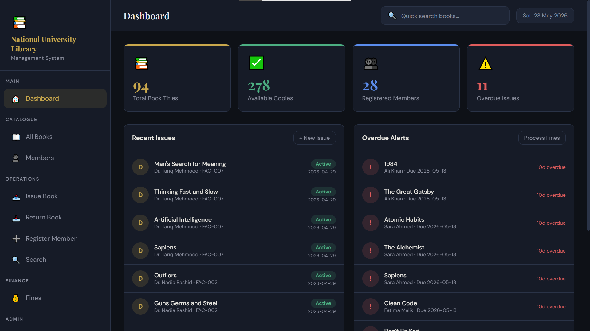
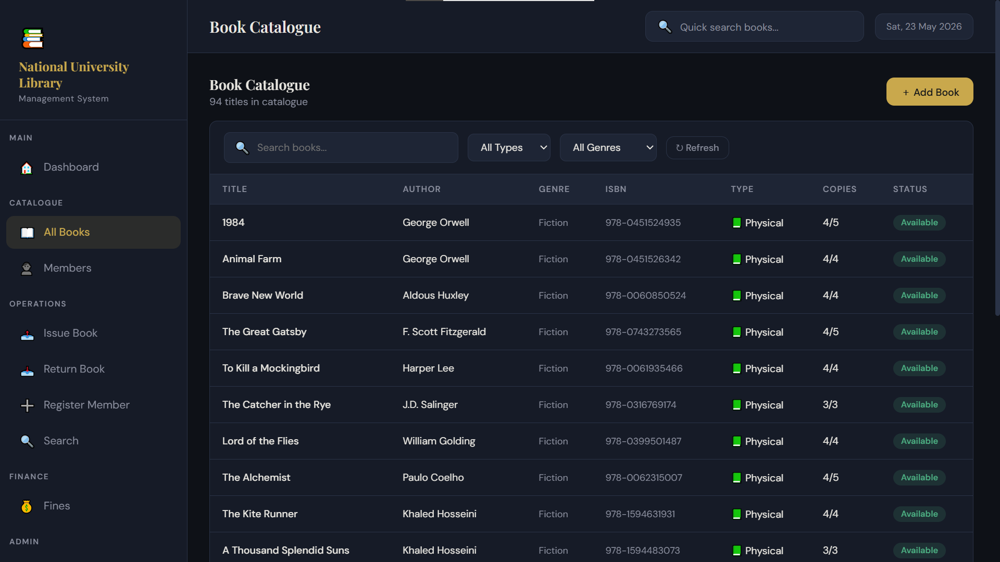
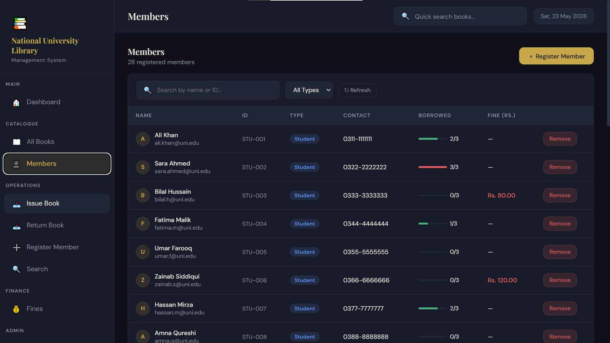
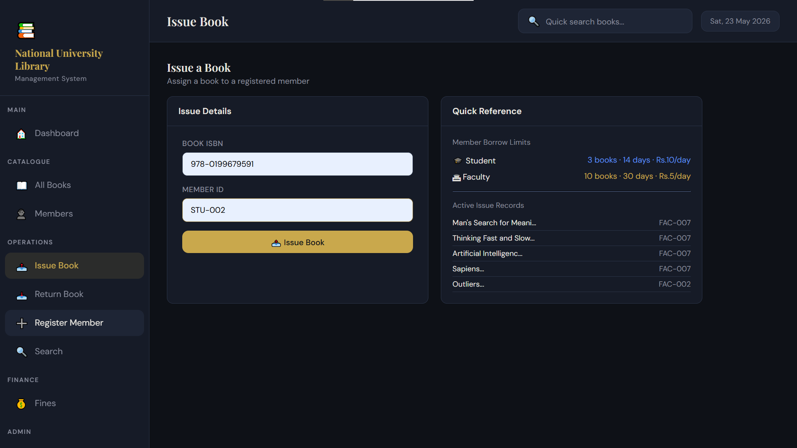
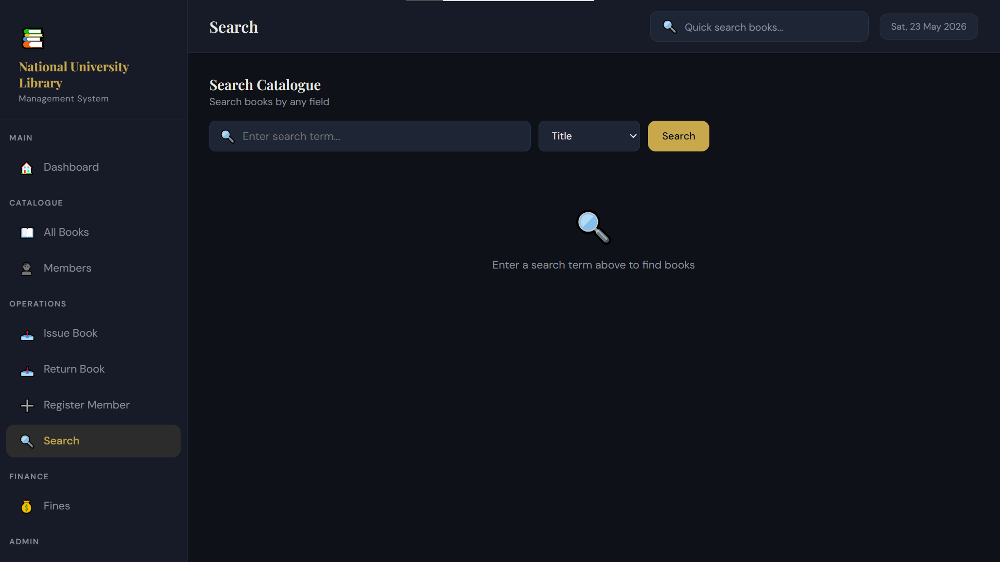
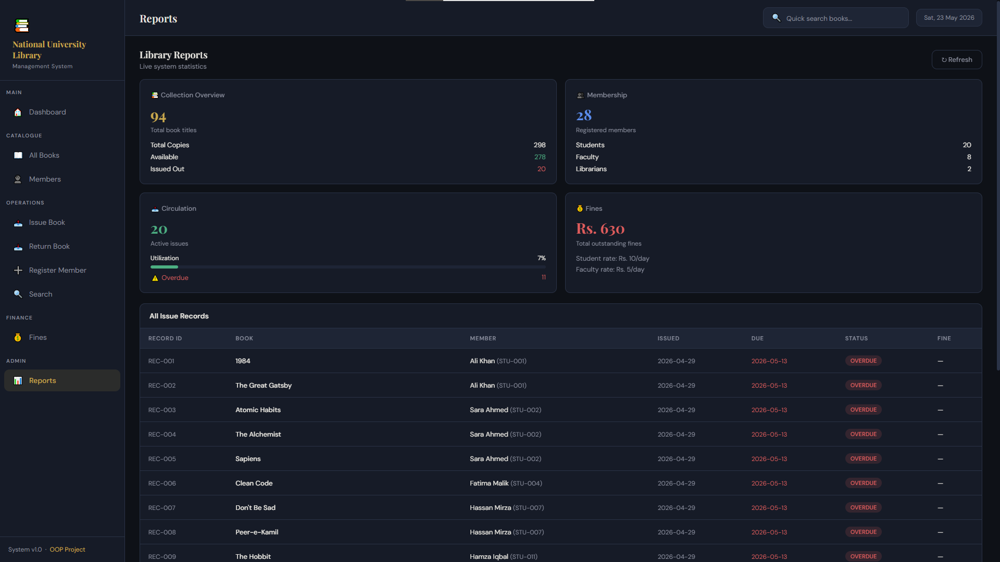

# 📚 Library Management System

A fully functional **Library Management System** built in **C++17** using Object-Oriented Programming principles. The system includes a web-based graphical interface powered by a local HTTP server, file-based data persistence, and covers all five core OOP concepts.

> **OOP Course Project** — National University of Computer and Emerging Sciences (FAST)
> **Authors:** Nyle Nauman Khan (25K-2537) · Muhammad Ahmed (25K-2511)

---

## 📸 Screenshots

<table>
  <tr>
    <td></td>
    <td></td>
  </tr>
  <tr>
    <td align="center"><b>Dashboard</b></td>
    <td align="center"><b>Book Catalogue</b></td>
  </tr>
  <tr>
    <td></td>
    <td></td>
  </tr>
  <tr>
    <td align="center"><b>Member Management</b></td>
    <td align="center"><b>Issue / Return</b></td>
  </tr>
  <tr>
    <td></td>
    <td></td>
  </tr>
  <tr>
    <td align="center"><b>Search with Autocomplete</b></td>
    <td align="center"><b>Reports & Dashboard</b></td>
  </tr>
</table>

---

## ✨ Features

| Feature | Description |
|---|---|
| 📚 **Book Management** | Add, remove, and view Physical books, EBooks, and Reference books |
| 👤 **Member Management** | Register Students, Faculty, and Librarians with full profile support |
| 📤 **Issue & Return** | Full borrow/return system with due dates and transaction records |
| 🔍 **Smart Search** | Case-insensitive search by title, author, genre, or ISBN with live autocomplete |
| 💰 **Fine Calculation** | Automatic overdue fine calculation with different rates per member type |
| 📊 **Reports** | Live dashboard with stats on books, members, issues, and fines |
| 💾 **Data Persistence** | All data saves automatically to disk and reloads on next launch |
| 🌐 **Web GUI** | Browser-based graphical interface served from the C++ backend |

---

## 🏗️ OOP Concepts Applied

```
Encapsulation   →  Private data in every class, accessed only through public methods
Inheritance     →  Person → Member → Student / Faculty  |  Book → EBook / ReferenceBook
Polymorphism    →  getBorrowLimit(), getFineRate(), borrowBook() — different per subclass
Abstraction     →  Library hides all internal logic behind clean method calls
Composition     →  Library owns Books, Members, IssueRecords, SearchEngine, FineCalculator
```

---

## 🗂️ Class Hierarchy

```
Person  (abstract)
├── Member  (abstract)
│   ├── Student       — 3 books · 14 days · Rs.10/day fine
│   └── Faculty       — 10 books · 30 days · Rs.5/day fine
└── Librarian         — Admin access, no borrow limit

Book
├── EBook             — Always available, digital format
└── ReferenceBook     — In-library use only, cannot be borrowed

IssueRecord           — One transaction per borrow
FineCalculator        — Overdue fine engine
SearchEngine          — Case-insensitive multi-field search
Library               — Central coordinator (composition root)
```

---

## 📁 Project Structure

```
library-management-system/
│
├── Person.h / .cpp           # Abstract base class for all people
├── Member.h / .cpp           # Abstract member with borrow logic
├── Student.h / .cpp          # Student — 3 book limit
├── Faculty.h / .cpp          # Faculty — 10 book limit
├── Librarian.h / .cpp        # Librarian — admin role
│
├── Book.h / .cpp             # Physical book with copy tracking
├── EBook.h / .cpp            # Digital book, always available
├── ReferenceBook.h / .cpp    # In-library only, cannot borrow
│
├── IssueRecord.h / .cpp      # Borrow transaction record
├── FineCalculator.h / .cpp   # Overdue fine calculation
├── SearchEngine.h / .cpp     # Multi-field book/member search
│
├── Library.h / .cpp          # Core manager — all operations
├── LibraryJSON.cpp           # JSON serialization for GUI
├── LibrarySave.cpp           # File persistence (save/load)
│
├── server_main.cpp           # HTTP server + API routes (GUI mode)
├── main.cpp                  # Terminal menu (non-GUI mode)
│
├── httplib.h                 # Single-header HTTP library (download separately)
├── index.html                # Web-based GUI
│
├── data/                     # Auto-created — persisted library data
│   ├── books.dat
│   ├── members.dat
│   └── issues.dat
│
└── screenshots/              # UI screenshots
```

---

## 🚀 Getting Started

### Prerequisites

- **g++** with C++17 support (MinGW on Windows, g++ on Linux/Mac)
- A modern web browser (Chrome, Firefox, Edge)

### 1 — Download httplib.h

Download the single-header HTTP library and place it in the project folder:

```
https://raw.githubusercontent.com/yhirose/cpp-httplib/master/httplib.h
```

> Right-click the link → Save As → save as `httplib.h` in the project folder.

### 2 — Compile (GUI mode)

```bash
g++ -std=c++17 Person.cpp Member.cpp Student.cpp Faculty.cpp Librarian.cpp Book.cpp EBook.cpp ReferenceBook.cpp IssueRecord.cpp FineCalculator.cpp SearchEngine.cpp Library.cpp LibraryJSON.cpp LibrarySave.cpp server_main.cpp -o library_gui -lws2_32
```

> **Note:** `-lws2_32` is Windows-only. On Linux/Mac, remove it.

### 3 — Run

```bash
./library_gui.exe
```

### 4 — Open the GUI

Open your browser and go to:

```
http://localhost:8080
```

The system loads with **91 preloaded books** and **28 preloaded members** including active borrows and outstanding fines for demonstration.

---

### Terminal Mode (no GUI)

Compile and run without the web interface:

```bash
g++ -std=c++17 Person.cpp Member.cpp Student.cpp Faculty.cpp Librarian.cpp Book.cpp EBook.cpp ReferenceBook.cpp IssueRecord.cpp FineCalculator.cpp SearchEngine.cpp Library.cpp LibrarySave.cpp main.cpp -o library_terminal -lws2_32

./library_terminal.exe
```

---

## 💾 Data Persistence

All data saves automatically to a `data/` folder on every change:

| File | Contents |
|---|---|
| `data/books.dat` | All books with current available copy counts |
| `data/members.dat` | All members with outstanding fines |
| `data/issues.dat` | All borrow records with exact timestamps |

On first launch the folder is created automatically. To reset to default seed data, delete the `data/` folder and restart.

---

## 👥 Preloaded Demo Data

| Category | Count |
|---|---|
| Physical Books | 69 titles across Fiction, Sci-Fi, History, Technology, Islamic, Urdu |
| EBooks | 12 titles |
| Reference Books | 10 titles |
| Students | 20 |
| Faculty | 8 |
| Librarians | 2 |
| Active Borrows | 17 |
| Members with Fines | 6 |

---

## 🔌 API Routes

The C++ server exposes the following JSON endpoints:

| Route | Method | Action |
|---|---|---|
| `/api/books` | GET | All books |
| `/api/members` | GET | All members |
| `/api/issues` | GET | All issue records |
| `/api/report` | GET | Dashboard statistics |
| `/api/search` | GET | Search books |
| `/api/issue` | POST | Issue a book |
| `/api/return` | POST | Return a book |
| `/api/books/add` | POST | Add a book |
| `/api/members/add` | POST | Register a member |
| `/api/members/remove` | POST | Remove a member |
| `/api/members/detail` | GET | Member profile |
| `/api/fines/process` | POST | Apply overdue fines |
| `/api/fines/pay` | POST | Record fine payment |

---

## 🛠️ Tech Stack

| Layer | Technology |
|---|---|
| Backend | C++17, OOP Architecture, 11 Classes |
| HTTP Server | [cpp-httplib](https://github.com/yhirose/cpp-httplib) |
| Frontend | HTML5, CSS3, Vanilla JavaScript |
| Persistence | Plain-text pipe-delimited flat files |

---

## 📄 License

This project was developed for academic purposes as part of the Object-Oriented Programming course at FAST-NUCES.

---

<p align="center">Built with C++ · OOP Course Project · FAST-NUCES 2025</p>
